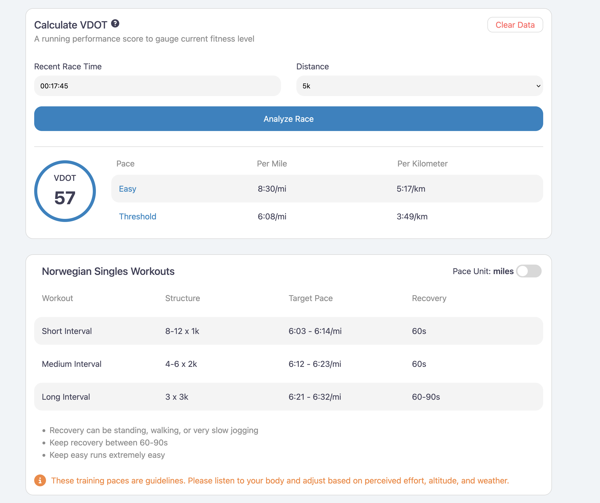

# The Norwegian Singles Method

The goal of this project is to provide an easy to use UI to calculate your
specific training running paces based on the Norwegian Singles Method. This
project also aims to provide the user with insight and the history of this method.



## Getting Started

To run this app locally, run:

```node
npm run dev
```

## Run Tests

To run unit tests, run:

```node
npm test
```

# threshold-is-fun
